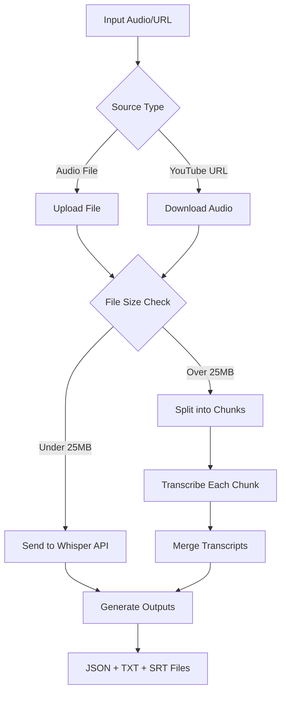

# YouTube Whisper Transcription

Transcribe audio files and YouTube videos using OpenAI's Whisper API with automatic subtitle generation.

## What This Does

This application transcribes any audio file or YouTube video into text with timestamps. Upload an MP3, WAV, or other audio file (or provide a YouTube URL) and receive back a full transcript, plain text, and subtitle files. The system handles files up to 25MB automatically by splitting them into chunks for processing.

## Prerequisites

Before you begin, you'll need:

1. **Python 3.8 or higher** - Check with `python --version`
2. **FFmpeg** - Required for audio processing
3. **OpenAI API Key** - Required for transcription

## Quick Setup (Recommended)

Use the provided setup scripts for automatic installation:

### Windows
```cmd
setup.bat
```

### Mac/Linux
```bash
chmod +x setup.sh
./setup.sh
```

These scripts will:
- Check for Python and FFmpeg
- Create a virtual environment
- Install all dependencies
- Help configure your OpenAI API key
- Create necessary directories
- Generate a run script for easy launching

After setup, run the application with:
- **Windows**: `run.bat`
- **Mac/Linux**: `./run.sh`

## Manual Installation

If you prefer to set up manually or the scripts don't work for your system:

### Step 1: Clone or Download

```bash
git clone https://github.com/yourusername/youtube-whisper.git
cd youtube-whisper
```

Or download and extract the ZIP file.

### Step 2: Install Python Dependencies

First, create a virtual environment to keep dependencies isolated:

```bash
# Create virtual environment
python -m venv venv

# Activate it
# On Windows:
venv\Scripts\activate
# On Mac/Linux:
source venv/bin/activate
```

Then install the required packages:

```bash
pip install -r requirements.txt
```

Or install manually:
```bash
pip install flask openai yt-dlp pydub
```

### Step 3: Install FFmpeg

FFmpeg is required for audio processing. 

**Check if you have it:**
```bash
ffmpeg -version
```

**If not installed:**

**Windows:**
1. Download from [ffmpeg.org](https://ffmpeg.org/download.html)
2. Extract the ZIP to `C:\ffmpeg`
3. Add `C:\ffmpeg\bin` to your system PATH:
   - Right-click "This PC" → Properties → Advanced System Settings
   - Click "Environment Variables"
   - Under "System Variables", find "Path", click Edit
   - Add `C:\ffmpeg\bin`
   - Click OK and restart your terminal
   - Detailed guide: [FFmpeg Windows Installation](https://www.wikihow.com/Install-FFmpeg-on-Windows)

**Mac:**
```bash
# Using Homebrew (install from brew.sh first)
brew install ffmpeg
```

**Linux (Ubuntu/Debian):**
```bash
sudo apt update
sudo apt install ffmpeg
```

For other systems, see [FFmpeg Download Page](https://ffmpeg.org/download.html)

### Step 4: Set Up OpenAI API Key

You need an API key from OpenAI to use the Whisper transcription service.

**Get your API key:**
1. Go to [OpenAI API Keys](https://platform.openai.com/api-keys)
2. Sign in or create an account (requires payment method)
3. Click "Create new secret key"
4. Copy the key that starts with `sk-`
5. Save it somewhere safe - you won't see it again
6. See [OpenAI API Quickstart](https://platform.openai.com/docs/quickstart) for detailed setup

**Set the API key in your environment:**

**Windows (Command Prompt):**
```cmd
set OPENAI_API_KEY=sk-your-key-here
```

**Windows (PowerShell):**
```powershell
$env:OPENAI_API_KEY="sk-your-key-here"
```

**Mac/Linux:**
```bash
export OPENAI_API_KEY="sk-your-key-here"
```

**To make it permanent:**

- **Windows**: Add it to your system environment variables
- **Mac/Linux**: Add the export line to `~/.bashrc` or `~/.zshrc`

**Verify it's set:**
```bash
# Mac/Linux:
echo $OPENAI_API_KEY
# Windows:
echo %OPENAI_API_KEY%
```

### Step 5: Create Data Directories

The application needs directories to store files:

```bash
mkdir -p data/audio data/transcripts data/subtitles
```

On Windows:
```cmd
mkdir data\audio
mkdir data\transcripts
mkdir data\subtitles
```

## Running the Application

1. Make sure your virtual environment is activated:
   ```bash
   # Windows:
   venv\Scripts\activate
   # Mac/Linux:
   source venv/bin/activate
   ```

2. Start the application:
   ```bash
   python app.py
   ```

3. Open your browser to:
   ```
   http://localhost:5000
   ```

4. Use the interface:
   - Select "Audio File" or "YouTube URL" from the dropdown
   - For audio files: Upload any audio file up to 25MB
   - For YouTube: Paste the video URL
   - Select the language
   - Click "Process"
   - Download your results (JSON, TXT, or SRT)

## Using with Private YouTube Videos

For age-restricted, private, or member-only YouTube videos, you need to provide your browser cookies.

### How to Get YouTube Cookies

1. **Install a browser extension for cookie export:**
   
   **Recommended (exports directly in Netscape format):**
   - Chrome/Edge: [Get cookies.txt LOCALLY](https://chrome.google.com/webstore/detail/get-cookiestxt-locally/cclelndahbckbenkjhflpdbgdldlbecc) - Open source, safe alternative
   - Firefox: [cookies.txt](https://addons.mozilla.org/en-US/firefox/addon/cookies-txt/)
   
   **Alternative options:**
   - [Cookie-Editor](https://chrome.google.com/webstore/detail/cookie-editor/hlkenndednhfkekhgcdicdfddnkalmdm) - Works on Chrome, Firefox, Edge (select Netscape export format)
   - [EditThisCookie](https://chrome.google.com/webstore/detail/editthiscookie/fngmhnnpilhplaeedifhccceomclgfbg) - Exports in JSON format (requires conversion)

2. **Export your YouTube cookies:**
   - Go to YouTube.com and sign in to your account
   - Navigate to the private video you want to download
   - Click the cookie extension icon in your browser
   - For "Get cookies.txt LOCALLY": Click the download button
   - For "Cookie-Editor": Click Export → Select "Netscape" format
   - For "EditThisCookie": Click Export (you'll get JSON format - see note below)
   - Copy all the text that appears

3. **Use the cookies in the application:**
   - Select "YouTube URL" as input type
   - Paste your YouTube URL
   - Paste the entire cookie text into the "Cookies" field
   - Process as normal

**Note about cookie formats:**
- yt-dlp requires Netscape format (starts with `# Netscape HTTP Cookie File`)
- If your extension exports JSON format, you'll need to convert it or use a different extension
- "Get cookies.txt LOCALLY" is recommended as it exports directly in the correct format

**Important notes about cookies:**
- Cookies contain your login session - keep them private
- They expire when you log out of YouTube
- If videos stop working, export fresh cookies
- Never share your cookies file with others
- Cookie format requirements: See [yt-dlp cookie documentation](https://github.com/yt-dlp/yt-dlp/wiki/FAQ#how-do-i-pass-cookies-to-yt-dlp)
  - Must be in Netscape format (first line: `# Netscape HTTP Cookie File`)
  - Some extensions export JSON format which needs conversion

## How It Works



**The process:**
1. Audio is extracted from YouTube or uploaded directly
2. Large files are automatically split into 10-minute chunks
3. Each chunk is transcribed using OpenAI's Whisper API
4. Timestamps are preserved and adjusted when merging
5. Three output formats are generated with full timestamp data

## API Costs

OpenAI charges for Whisper API usage:
- **Current pricing**: See [OpenAI API Pricing](https://openai.com/api/pricing/) (Audio models section)
- At time of writing: $0.006 per minute of audio
- Example: A 1-hour video costs ~$0.36, a 10-minute video costs ~$0.06
- You can set spending limits in your [OpenAI account dashboard](https://platform.openai.com/account/limits)

## Output Files

The application generates three file types:

- **JSON** - Complete transcript with timestamp data for each segment
- **TXT** - Plain text transcript without timestamps  
- **SRT** - Subtitle file compatible with video editors and players ([SRT format spec](https://en.wikipedia.org/wiki/SubRip))

Files are saved in:
```
data/
├── transcripts/   # JSON and TXT files
└── subtitles/     # SRT files
```

## Troubleshooting

### "OPENAI_API_KEY environment variable not set"
- Make sure you've set the API key in your environment
- Check it's set: `echo $OPENAI_API_KEY` (Mac/Linux) or `echo %OPENAI_API_KEY%` (Windows)
- Make sure you activated the virtual environment

### "Failed to download audio"
- Check your internet connection
- For private videos, make sure your cookies are fresh
- Try with a public YouTube video to test

### "No module named 'flask'" or similar
- Make sure you activated the virtual environment
- Install dependencies: `pip install -r requirements.txt`

### "FFmpeg not found"
- Install FFmpeg (see Step 3 above)
- Restart your terminal after installation
- Check it's in PATH: `ffmpeg -version`

### Application won't start
- Check Python version: `python --version` (needs 3.8+)
- Make sure port 5000 is not in use
- Try a different port: `python app.py --port 5001`

### Large files taking too long
- Files over 25MB are split into chunks
- Each 10-minute chunk takes 30-60 seconds typically
- Check the processing log in the browser for progress

## File Structure

```
youtube-whisper/
├── app.py              # Main application
├── requirements.txt    # Python dependencies
├── README.md          # This file
├── .gitignore         # Git ignore rules
└── data/              # Generated files
    ├── audio/         # Temporary audio files
    ├── transcripts/   # JSON and TXT outputs
    └── subtitles/     # SRT subtitle files
```

## Privacy & Security

- Your audio files are processed locally and sent only to OpenAI's API
- Temporary audio files are deleted after processing (unless KEEP_AUDIO_FILES is set)
- YouTube cookies contain your login session - never share them
- Your OpenAI API key is never stored by the application

## Additional Resources

- [OpenAI Whisper API Documentation](https://platform.openai.com/docs/guides/speech-to-text)
- [yt-dlp Documentation](https://github.com/yt-dlp/yt-dlp#readme)
- [yt-dlp Cookie FAQ](https://github.com/yt-dlp/yt-dlp/wiki/FAQ#how-do-i-pass-cookies-to-yt-dlp)
- [FFmpeg Documentation](https://ffmpeg.org/documentation.html)
- [Netscape Cookie File Format](http://fileformats.archiveteam.org/wiki/Netscape_cookies.txt)